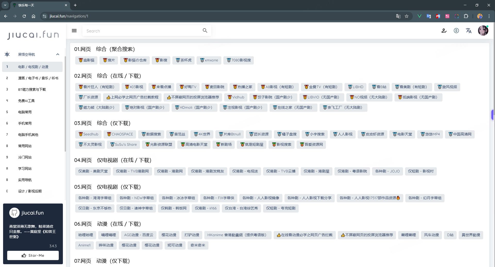

# 韭菜网 jiucai.fun

## 韭菜网3.4.3版本的开源项目，主要来展示zfoo在网页端的应用，主要功能如下

- chatgpt
    - 讯飞星火大模型
    - 文心一言
    - 腾讯混元
    - 通义千问
    - meta llama
    - deep seek
    - google gemini
    - bing 联网搜索
    - google 联网搜索
    - b站联网搜索
  
- Midjoruney 文生图
- Midjoruney 图生图
- Stable Diffusion 图片生成
- 写实AI
- 聊天广场，websocket群聊
- 图片分享
- 网址导航

- 主页
    - 爬取热点概念
    - 爬取热点股票
    - 市场量能
    - 韭菜指数
    - AI消息分级

## 本地启动
- backend 后端，[强依赖zfoo框架](https://github.com/zfoo-project/zfoo)
  - cloud 入口，主要核心业务服务器，有很多其它的第三方api依赖需要自己申请token权限
  - home 主要放在家里的服务器，处理一些次要业务

- frotend 前端，[主要使用vuetify3框架](https://github.com/yangjiakai/lux-ui)
  - 先安装依赖 npm install
  - 本地运行 npm run jiucai
  

