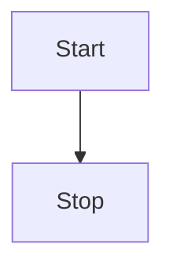

## 😲 快乐韭菜网

因为run的快，所以是一个快乐的韭菜！


## ☘️ Chatgpt教程

> 快乐韭菜网使用的 chatgpt 3.5 模型

- [如何让chatgpt给出更高质量的答案](https://zhuanlan.zhihu.com/p/667126116)

### 🤖 Midjourney教程

快乐韭菜网集成了Midjourney的 **文生图**, <u>图生图</u>, 

- [按键介绍](https://blog.csdn.net/ygxfbpkn/article/details/138727851)

- [视频教程](https://www.bilibili.com/video/BV1vm4y1B7gP)

- [全网最全MJ指令整理](https://g1ywwvn4f0m.feishu.cn/base/ICczbk9CoauVdls9helcMOUzn3b?table=tblQ3qyA5AE16h7r&view=vewPND11b4)

- [Midjourney 参数合集](https://zhuanlan.zhihu.com/p/618360220)

## 🤗 Happy Code

1. So even though we face the difficulties of today and tomorrow, I still have a dream.
2. It is a dream deeply rooted in the American dream.
3. I have a dream that one day this nation will rise up.

- [ ] Friday
- [ ] Saturday
- [x] Sunday

```vue

<template>
  <MdEditor v-model="text"/>
</template>

<script setup>
import {ref} from 'vue';
import {MdEditor} from 'md-editor-v3';
import 'md-editor-v3/lib/style.css';

const text = ref('Hello Editor!');
</script>
```

## 🖨 Text

The Old Man and the Sea served to reinvigorate Hemingway's literary reputation and prompted a reexamination of his
entire body of work.

## 📈 Table

| nickname | from             |
|----------|------------------|
| zhijian  | ChongQing, China |

## 📏 Formula

Inline: $x+y^{2x}$

$$
\sqrt[3]{x}
$$

## 🧬 Diagram



## 🪄 Alert

!!! note Supported Types

note、abstract、info、tip、success、question、warning、failure、danger、bug、example、quote、hint、caution、error、attention

!!!